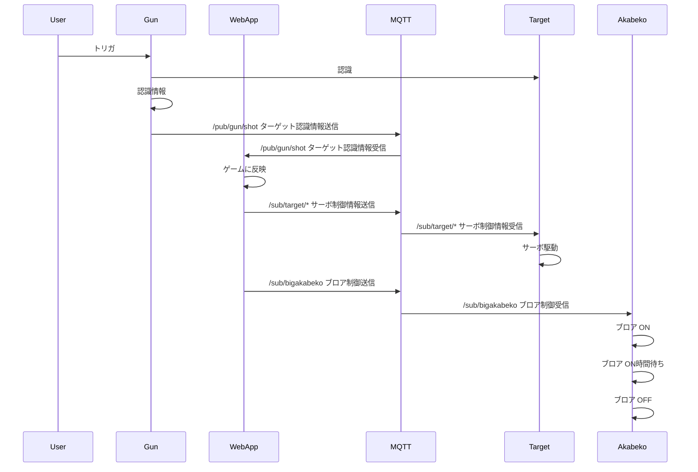
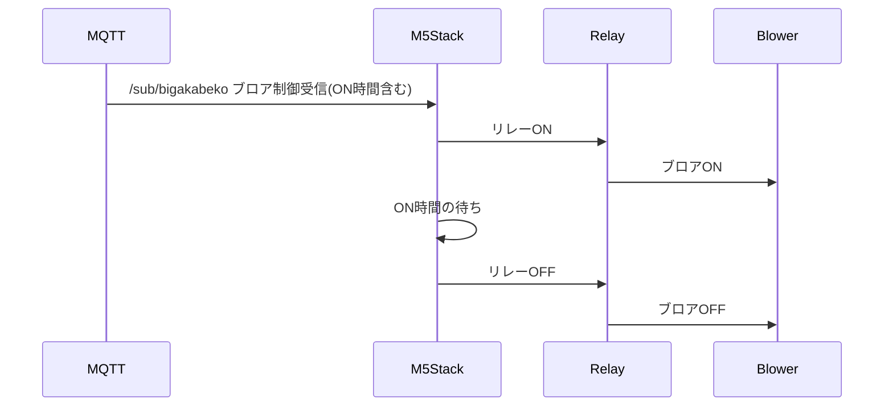
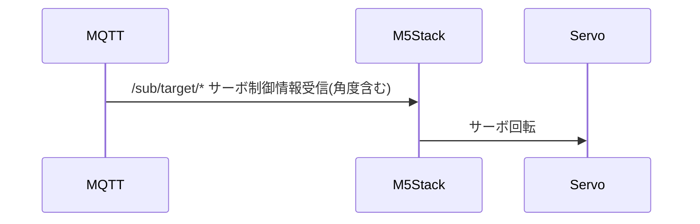

# シーケンス
## 銃発射

```mermaid
sequenceDiagram
    participant U as User
    participant G as Gun
    participant W as WebApp
    participant M as MQTT
    participant T as Target
    participant A as Akabeko

    U ->> G: トリガ
    G ->> T: 認識
    G ->> G: 認識情報
    G ->> M: /pub/gun/shot ターゲット認識情報送信
    M ->> W: /pub/gun/shot ターゲット認識情報受信
    W ->> W: ゲームに反映
    W ->> M: /sub/target/* サーボ制御情報送信
    M ->> T: /sub/target/* サーボ制御情報受信
    T ->> T: サーボ駆動
    W ->> M: /sub/bigakabeko ブロア制御送信
    M ->> A: /sub/bigakabeko ブロア制御受信
    A ->> A: ブロア ON
    A ->> A: ブロア ON時間待ち
    A ->> A: ブロア OFF
```

## ブロア制御

```mermaid
sequenceDiagram
    participant M as MQTT
    participant M5 as M5Stack
    participant R as Relay
    participant B as Blower

    M ->> M5: /sub/bigakabeko ブロア制御受信(ON時間含む)
    M5 ->> R: リレーON
    R ->> B: ブロアON
    M5 ->> M5: ON時間の待ち
    M5 ->> R: リレーOFF
    R ->> B: ブロアOFF
```

## クラッピー制御

```mermaid
sequenceDiagram
    participant M as MQTT
    participant M5 as M5Stack
    participant S as Servo

    M ->> M5: /sub/target/* サーボ制御情報受信(角度含む)
    M5 ->> S: サーボ回転
```
